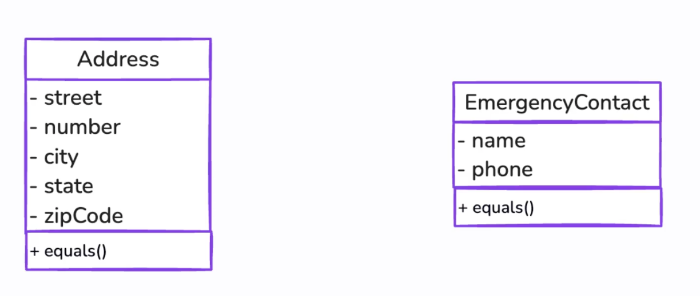
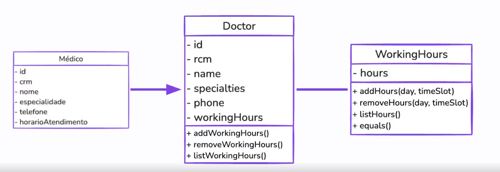

# Domain-Driven Design: Rocket Medic Healthcare System

> A practical implementation of Domain-Driven Design (DDD) principles using JavaScript/Node.js, demonstrating tactical patterns through a healthcare management system.

## 🎯 Overview

**Rocket Medic** is an educational project showcasing how to implement Domain-Driven Design patterns in a real-world healthcare domain. This implementation follows modern software architecture principles with clean separation of concerns.

## 🚀 Quick Start

```bash
# Install dependencies
npm install

# Run all tests
npm test

# Run tests with coverage
npm run coverage

# Start the API server
npm start

# Development mode (with auto-reload)
npm run dev

# Visit health check
curl http://localhost:3000/health
```

## 📚 Documentation

### Getting Started

- **[Quick Start Guide](QUICK_START.md)** - Get up and running in minutes
- **[API Documentation](docs/API.md)** - REST API endpoints and usage
- **[Project Structure](docs/ARCHITECTURE.md)** - Code organization and architecture

### DDD Concepts

- **[What is Domain-Driven Design?](domain-driven-design-explained.md)** - Introduction to DDD
- **[Domain Concepts](concepts/what-is-domain.md)** - Understanding business domains
- **[Model Elements](concepts/model-elements.md)** - Entities, Value Objects, Services
- **[Aggregates](concepts/aggregates.md)** - Aggregate patterns and boundaries
- **[Domain Services](concepts/domain-services.md)** - Business logic organization

### Architecture Patterns

- **[Hexagonal Architecture](concepts/architecture/hexagonal-architecture.md)** - Ports and Adapters
- **[Layered Architecture](concepts/architecture/layered-architecture.md)** - Layer separation
- **[Anticorruption Layer](concepts/architecture/anticorruption-layer.md)** - Protecting your domain from external systems

### Implementation Details

- **[Implementation Summary](IMPLEMENTATION_SUMMARY.md)** - Quick reference guide
- **[Domain Model](docs/DOMAIN_MODEL.md)** - Detailed domain structure
- **[Development Guide](docs/DEVELOPMENT.md)** - Contributing and best practices
- **[Q&A](QA.md)** - Common questions and answers (PT-BR & EN)

## 🏗️ Architecture

The project follows **Hexagonal Architecture** (Ports & Adapters) with clear separation:

```
src/
├── domain/              # Core business logic (no dependencies)
│   ├── entities/       # Domain entities (Patient, Doctor, Appointment)
│   │   └── record/    # Medical record entities
│   ├── value-objects/  # Immutable value objects (Address, WorkingHours)
│   ├── services/       # Domain services (business rules)
│   │   └── doctor-service/ # Doctor-specific services
│   └── repositories/   # Repository interfaces
├── application/        # Use cases and application services
│   └── services/      # Application services
├── infrastructure/     # External concerns (DB, notifications)
│   ├── persistance/   # Repository implementations
│   └── notification/  # Notification services
├── interfaces/        # Entry points (REST API, controllers)
│   ├── controllers/   # HTTP request handlers
│   │   └── doctor-controllers/ # Doctor-specific controllers
│   ├── routes/        # API route definitions
│   └── main.js        # Application bootstrap
└── testCase/          # Manual test examples

tests/
├── unit/              # Unit tests
│   ├── domain/       # Domain layer tests
│   │   ├── entities/
│   │   ├── value-objects/
│   │   └── services/
│   └── infrastructure/ # Infrastructure tests
├── integration/       # Integration tests
│   ├── controllers/  # Controller integration tests
│   ├── repositories/ # Repository integration tests
│   └── workflows/    # Full workflow tests
├── domain/            # Domain-focused tests
├── asyncronous/       # Async pattern tests
└── TESTING_TOOLS.md   # Testing documentation

concepts/              # DDD learning resources
└── architecture/      # Architecture pattern docs

docs/                  # Project documentation

.github/
└── workflows/         # CI/CD pipelines
    └── ci.yml        # GitHub Actions workflow
```

## 🏥 Domain Model

### Core Aggregates

**Patient Aggregate** - Manages patient information and medical history

- Patient (root entity)
- Medical Record
- Allergies, Diagnoses, Treatments
- Medications
- Appointments and Examinations

**Doctor Aggregate** - Manages doctor information and availability

- Doctor (root entity)
- Working Hours
- Specialties (array)
- Availability management

**Appointment Aggregate** - Manages appointment scheduling

- Appointment (root entity)
- Patient reference
- Doctor reference
- Status tracking

### Key Features

- ✅ Patient management with comprehensive medical records
- ✅ Doctor scheduling and availability tracking
- ✅ Appointment booking with validation
- ✅ Medical examination tracking
- ✅ Diagnosis and medication management
- ✅ Email notifications
- ✅ RESTful API with Express.js
- ✅ Automated testing with 60%+ coverage
- ✅ CI/CD with GitHub Actions

## 🛠️ Technology Stack

### Core

- **Runtime**: Node.js 20+
- **Language**: JavaScript (ES6+ modules)
- **Web Framework**: Express.js 4.18.2
- **Architecture**: Hexagonal/Clean Architecture with DDD patterns

### Testing

- **Test Runner**: Mocha 11.7.5
- **Assertions**: Chai 6.2.2 (BDD style)
- **Test Doubles**: Sinon 21.0.1 (stubs, spies, mocks)
- **Coverage**: c8 10.1.3 (HTML, LCOV, text reporters)

### Code Quality

- **Linter**: ESLint 8.57.0
- **Formatter**: Prettier 3.1.1

### CI/CD

- **GitHub Actions**: Automated testing and coverage checks
- **Coverage Threshold**: 50% (lines, functions, branches, statements)

## 📖 Learning Resources

### Beginners

1. Start with [Quick Start Guide](QUICK_START.md)
2. Read [What is Domain-Driven Design?](domain-driven-design-explained.md)
3. Explore [Domain Model](docs/DOMAIN_MODEL.md)
4. Run the examples in `src/testCase/`

### Intermediate

1. Study [Aggregates](concepts/aggregates.md) patterns
2. Understand [Hexagonal Architecture](concepts/architecture/hexagonal-architecture.md)
3. Review [Implementation Summary](IMPLEMENTATION_SUMMARY.md)
4. Examine the domain services

### Advanced

1. Read [Development Guide](docs/DEVELOPMENT.md)
2. Study repository implementations
3. Extend the domain with new features
4. Implement additional bounded contexts

## 🧪 Testing

### Automated Tests (38 tests)

```bash
# Run all tests
npm test

# Run tests with coverage (60.68% overall)
npm run coverage

# Open HTML coverage report
open coverage/index.html

# Run specific test file
npm test -- tests/integration/workflows/patient-appointment-workflow.test.js
```

### Test Coverage

- **Entities**: Patient, Doctor, Appointment (100% covered)
- **Value Objects**: Address, EmergencyContact, Allergy (100% covered)
- **Repositories**: Repository pattern with Map storage
- **Services**: PatientService, DoctorService (32-66% covered)
- **Controllers**: PatientController integration tests
- **Workflows**: Full patient appointment workflow test

### Manual Testing

```bash
# Run manual test examples
cd src && node testCase/testHospital.js

# Test API endpoints
npm start &
curl http://localhost:3000/api/patients
curl http://localhost:3000/api/doctors
```

### CI/CD

GitHub Actions automatically runs:

- All tests on every push
- Coverage checks (minimum 50%)
- ESLint validation
- Runs on Node.js 18

## 📝 Code Quality

```bash
# Lint code
npm run lint

# Auto-fix issues
npm run lint:fix

# Format code
npm run format

# Check formatting
npm run format:check

# Run full quality check
npm run lint && npm run format:check && npm test
```

### Quality Tools

- **ESLint**: Catches common errors and enforces coding standards
- **Prettier**: Ensures consistent code formatting
- **Mocha + Chai**: Comprehensive test coverage
- **c8**: Istanbul-based code coverage reporting

## 🤝 Contributing

See [Development Guide](docs/DEVELOPMENT.md) for:

- Coding standards
- Adding new features
- Domain modeling guidelines
- Testing strategies

## 📄 License

This is an educational project for learning Domain-Driven Design principles.

## 🔗 Related Resources

- [Domain-Driven Design by Eric Evans](https://www.domainlanguage.com/ddd/)
- [Implementing Domain-Driven Design by Vaughn Vernon](https://vaughnvernon.com/)
- [DDD Community](https://github.com/ddd-crew)

---

**Made with ❤️ for learning Domain-Driven Design**

**Entities** have unique identity that persists over time:

- **Patient** - Identified by `id` and `identificationDocument`
- **Doctor** - Identified by `id` and `rcm` (medical license)
- **Appointment** - Identified by `id`
- **Examination** - Identified by `id`
- **MedicalRecord** - Internal entity within Patient aggregate

### 3. Value Objects

**Value Objects** are defined by their attributes, not identity:

#### Address Value Object



```javascript
class Address {
  constructor(street, number, city, state, zipCode) {
    this.street = street;
    this.number = number;
    this.city = city;
    this.state = state;
    this.zipCode = zipCode;
  }

  equals(otherAddress) {
    return (
      this.street === otherAddress.street &&
      this.number === otherAddress.number &&
      this.city === otherAddress.city &&
      this.state === otherAddress.state &&
      this.zipCode === otherAddress.zipCode
    );
  }
}
```

#### EmergencyContact Value Object

```javascript
class EmergencyContact {
  constructor(name, phone) {
    this.name = name;
    this.phone = phone;
  }

  equals(otherContact) {
    return this.name === otherContact.name && this.phone === otherContact.phone;
  }
}
```

#### WorkingHours Value Object



```javascript
class WorkingHours {
  constructor() {
    this.hours = [];
  }

  addHours(day, timeSlot) {
    this.hours.push({ day, timeSlot });
  }

  removeHours(day, timeSlot) {
    this.hours = this.hours.filter(
      (hour) => hour.day !== day || hour.timeSlot !== timeSlot
    );
  }

  listHours() {
    return this.hours;
  }
}
```

## 🚀 Running the Example

### Prerequisites

- Node.js 14+ (for ES6 module support)

### Setup

```bash
# Install dependencies
npm install

# Run linting
npm run lint

# Auto-fix formatting issues
npm run lint:fix

# Format all files
npm run format

# Run the test example
cd rocket-medic
node testHospital.js
```

### Example Output

```javascript
Allergy Penicillin added to patient John Doe
Appointment on 2024-07-01 scheduled for patient John Doe
Patient {
  id: '1',
  identificationDocument: '123.123.123-12',
  name: 'John Doe',
  dateOfBirth: '1990-01-01',
  gender: 'Male',
  bloodType: 'O+',
  address: Address { ... },
  phoneNumber: '+1234567890',
  email: 'johndoe@example.com',
  emergencyContact: EmergencyContact { ... },
  allergies: [ Allergy { type: 'Penicillin' } ],
  appointments: [ Appointment { ... } ],
  examinations: [ ... ],
  medicalRecord: MedicalRecord { ... }
}
```

## 🎨 Code Quality

This project uses ESLint and Prettier to enforce code quality and consistent formatting:

### ESLint Rules

- Function parameters on new lines for better readability
- Maximum line length of 80 characters
- 2-space indentation
- Single quotes
- Semicolons required

### Configuration Files

- [`.eslintrc.json`](.eslintrc.json) - ESLint configuration
- [`.prettierrc.json`](.prettierrc.json) - Prettier configuration

## 📖 Learning Path

1. **Start with concepts:**
   - Read [Domain-Driven Design Explained](domain-driven-design-explained.md)
   - Understand [What is Domain?](concepts/what-is-domain.md)

2. **Learn tactical patterns:**
   - Study [Model Elements](concepts/model-elements.md)
   - Deep dive into [Aggregates](concepts/aggregates.md)

3. **Explore architecture:**
   - Review [Hexagonal Architecture](concepts/architecture/hexagonal-architecture.md)
   - Compare with [Layered Architecture](concepts/architecture/layered-architecture.md)

4. **Study the implementation:**
   - Examine the `rocket-medic/` folder
   - Run and modify `testHospital.js`
   - Experiment with adding new features

## 🔑 Key Takeaways

### Aggregate Design

- **Patient** and **Doctor** are separate aggregates with clear boundaries
- **MedicalRecord** is an internal entity, not a separate aggregate
- Aggregates protect business invariants through encapsulation

### Value Objects

- **Address**, **EmergencyContact**, and **WorkingHours** have no identity
- Equality is based on attribute values
- Can be freely shared across entities

### Business Logic Encapsulation

- Business rules are enforced through aggregate methods
- Direct manipulation of internal state is prevented
- Validation happens at the aggregate boundary

### Consistency Boundaries

- Each aggregate maintains its own consistency
- References between aggregates should ideally use IDs (simplified in this example)
- One transaction per aggregate

## 🔧 Future Enhancements

To make this a production-ready system, consider:

1. **Reference by ID**: Change appointments to reference Patient and Doctor by ID
2. **Domain Events**: Implement events for cross-aggregate communication
3. **Repositories**: Add persistence layer with repository pattern
4. **Application Services**: Create application layer for use case orchestration
5. **Validation**: Add comprehensive validation for all value objects
6. **Testing**: Add unit and integration tests
7. **Error Handling**: Implement robust error handling and domain exceptions

## 📚 Additional Resources

- Eric Evans - "Domain-Driven Design: Tackling Complexity in the Heart of Software"
- Vaughn Vernon - "Implementing Domain-Driven Design"
- Martin Fowler - [Domain-Driven Design](https://martinfowler.com/bliki/DomainDrivenDesign.html)

## 📄 License

This is an educational project for demonstrating DDD concepts.
