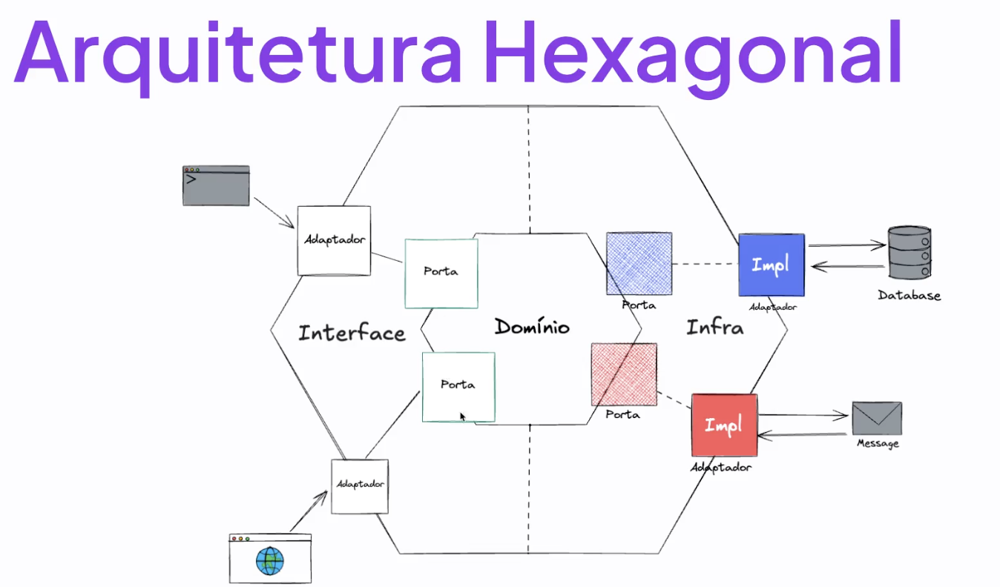

# Hexagonal Architecture (Ports and Adapters)

> **Live Example**: The [Rocket Medic implementation](../../README.md) in this repository uses Hexagonal Architecture. See [docs/ARCHITECTURE.md](../../docs/ARCHITECTURE.md) for detailed explanation.

## What is Hexagonal Architecture?

**Hexagonal Architecture**, also known as **Ports and Adapters Architecture**, is a software design pattern that focuses on keeping your core business logic completely independent from external systems, frameworks, and delivery mechanisms. Unlike layered architecture which organizes code in horizontal layers, hexagonal architecture places your domain at the center and surrounds it with adapters.

The name "hexagonal" comes from the visual representation where the core is in the center of a hexagon, with external systems connected through ports on the sides. The hexagon shape itself isn't important—it's just a convenient way to show that there can be many different connection points.

## Core Concept

> **Put your business logic at the center, and everything else (UI, databases, external services) connects to it through well-defined interfaces (ports).**

The key idea is that your application's core shouldn't know or care about:

- What database you're using
- Whether it's accessed via web, mobile, or command line
- Which external APIs you call
- What framework you're running on

## The Main Components

### 1. **The Core (Domain/Application Core)**

**What it is:** The heart of your application containing all business logic and rules.

**Contains:**

- Business entities and value objects
- Business rules and validation
- Use cases and workflows
- Domain services

**Characteristics:**

- No dependencies on external frameworks or libraries
- Pure business logic
- Framework-agnostic
- Contains what your application does, not how it does it

**Think of it as:** The brain of your application—it knows what needs to happen but doesn't care about the technical details of how.

### 2. **Ports**

**What they are:** Interfaces that define how the outside world can interact with your core.

**Two types:**

**Inbound Ports (Driving Ports):**

- Define what your application can do
- Entry points into your core
- Examples: "PlaceOrder", "RegisterUser", "CalculatePrice"

**Outbound Ports (Driven Ports):**

- Define what your application needs from the outside
- Exit points from your core
- Examples: "SaveOrder", "SendEmail", "GetUserData"

**Think of them as:** Electrical sockets in your house—they define a standard way to connect, but don't care what specific device you plug in.

### 3. **Adapters**

**What they are:** Concrete implementations that connect external systems to your ports.

**Two types:**

**Inbound Adapters (Driving Adapters/Primary Adapters):**

- Receive input from users or systems and call your core
- Examples: REST API controllers, GraphQL resolvers, CLI commands, web pages, scheduled jobs

**Outbound Adapters (Driven Adapters/Secondary Adapters):**

- Implement the interfaces your core needs
- Examples: Database repositories, email services, payment gateways, file storage

**Think of them as:** Specific devices that plug into your sockets—a lamp, a phone charger, a computer. Each device is different but uses the same socket interface.

## Visual Representation

```
                    ┌─────────────────────┐
                    │   Web Controller    │ ← Inbound Adapter (REST API)
                    └──────────┬──────────┘
                               │
                    ┌──────────▼──────────┐
                    │   Inbound Port       │ ← Interface: PlaceOrder
                    │  (Use Case)          │
                    └──────────┬──────────┘
                               │
        ╔══════════════════════▼══════════════════════╗
        ║                                              ║
        ║          APPLICATION CORE                    ║
        ║                                              ║
        ║  • Business Logic                           ║
        ║  • Domain Entities                          ║
        ║  • Business Rules                           ║
        ║  • No external dependencies                 ║
        ║                                              ║
        ╚══════════════════════▲══════════════════════╝
                               │
                    ┌──────────┴──────────┐
                    │   Outbound Port      │ ← Interface: SaveOrder
                    │  (Repository)        │
                    └──────────┬──────────┘
                               │
                    ┌──────────▼──────────┐
                    │  Database Adapter    │ ← Outbound Adapter (PostgreSQL)
                    └─────────────────────┘
```

### Complete Hexagonal Architecture Diagram



**Diagram Explanation:**

- **Domínio (Domain/Core)**: The center hexagon contains your business logic
- **Interface**: Left side showing inbound ports where requests enter (CLI, Web)
- **Infra (Infrastructure)**: Right side showing outbound adapters (Database, Message services)
- **Porta (Port)**: The interfaces that define contracts between layers
- **Adaptador (Adapter)**: Concrete implementations connecting external systems
- **Impl (Implementation)**: The actual adapter implementations

This diagram shows how different entry points (command line, web browser) and external services (database, messaging) all connect to the domain core through ports and adapters, keeping the business logic completely isolated.

## How It Works: A Simple Example

Let's imagine an e-commerce system where a customer places an order:

### The Flow:

**1. User Action:**

- User clicks "Place Order" on a website

**2. Inbound Adapter (REST Controller):**

- Receives HTTP POST request
- Extracts order data from request
- Calls the inbound port

**3. Inbound Port (Use Case Interface):**

- Defines the contract: `placeOrder(customerId, items)`

**4. Application Core:**

- Validates business rules (cart not empty, items in stock)
- Calculates total with discounts
- Creates Order entity
- Calls outbound port to save order
- Calls outbound port to send confirmation email

**5. Outbound Ports (Interfaces):**

- `OrderRepository.save(order)`
- `EmailService.send(email)`

**6. Outbound Adapters:**

- PostgreSQL adapter saves to database
- SendGrid adapter sends email

**7. Response flows back:**

- Core returns success/failure
- Inbound adapter converts to HTTP response
- User sees confirmation message

### The Key Point:

The core doesn't know it's being called by a web controller—it could just as easily be a mobile app, CLI tool, or scheduled job. The core also doesn't know it's using PostgreSQL or SendGrid—those could be swapped for MongoDB and Mailgun without changing the core.

## Benefits of Hexagonal Architecture

### 1. **Complete Independence of Core Business Logic**

Your business logic is entirely isolated from technical decisions.

**Practical Benefits:**

- Business rules don't change when you switch databases
- Same logic works for web, mobile, CLI, or batch processing
- Can test business logic without any infrastructure
- Framework upgrades don't affect core logic
- Technology decisions can be deferred

**Real-world example:** A fintech company can change from MongoDB to PostgreSQL for compliance reasons without touching any interest calculation or transaction validation logic.

### 2. **Technology Flexibility**

Easy to swap, upgrade, or add technologies without affecting the core.

**What You Can Change:**

- **Databases**: MySQL → PostgreSQL → MongoDB
- **Web frameworks**: Express → Fastify → Koa
- **Message queues**: RabbitMQ → Kafka → AWS SQS
- **Email services**: SendGrid → Mailgun → AWS SES
- **Cloud providers**: AWS → Azure → Google Cloud

**Real-world example:** Start with a simple file-based storage for a prototype, then switch to AWS S3 for production—only the adapter changes, core stays the same.

### 3. **Multiple Interfaces Simultaneously**

Your application can be accessed through many different interfaces at once.

**Possible Interfaces:**

- REST API for web applications
- GraphQL for mobile apps
- gRPC for microservices communication
- Command-line interface for admin tasks
- Scheduled jobs for batch processing
- WebSocket for real-time updates
- Message queue consumers

**Real-world example:** An e-commerce platform serves a website (REST API), mobile app (GraphQL), internal admin tool (CLI), and processes scheduled reports (batch jobs)—all using the same business logic.

### 4. **Superior Testability**

Testing becomes much easier and faster.

**Testing Benefits:**

- **Unit tests**: Test core business logic with no external dependencies
- **Integration tests**: Test adapters independently
- **Fast tests**: No need to start databases or web servers
- **Reliable tests**: No flaky tests due to external services
- **Easy mocking**: Clear interfaces make creating test doubles simple

**Real-world example:** Test your entire pricing engine, discount calculations, and order validation in milliseconds without touching a database or starting a web server.

### 5. **Clear Architecture and Organization**

The structure makes it obvious where code belongs.

**Organizational Benefits:**

- **Clear boundaries**: Know what's core and what's infrastructure
- **Easy navigation**: Finding code is straightforward
- **Consistent structure**: Every developer knows where to put new code
- **Self-documenting**: Architecture reveals design decisions
- **Onboarding**: New developers understand the system faster

**Real-world example:** A new developer knows that business validation goes in the core, HTTP handling goes in the web adapter, and database queries go in the repository adapter.

### 6. **Better Maintainability**

Code is easier to maintain and evolve over time.

**Maintenance Benefits:**

- **Isolated changes**: Modify adapters without touching core
- **Less ripple effect**: Changes in one area don't cascade everywhere
- **Easier debugging**: Clear boundaries help locate issues
- **Refactoring safety**: Well-defined interfaces protect against breaking changes
- **Long-term sustainability**: Core business logic can last for years unchanged

**Real-world example:** When a third-party payment API changes, you only update the payment adapter—no changes to order processing, pricing, or validation logic.

### 7. **Domain-Focused Development**

Developers can concentrate on business problems, not technical plumbing.

**Development Benefits:**

- **Business clarity**: Core contains pure business logic
- **Less technical distraction**: Don't think about databases while modeling business
- **Domain expert collaboration**: Non-technical people can understand core code better
- **Business value focus**: Spend more time on what matters to users
- **Ubiquitous language**: Code reflects business terminology

**Real-world example:** When implementing a new discount strategy, developers focus purely on the business rules without worrying about REST endpoints, database schemas, or caching strategies.

### 8. **Parallel Development**

Teams can work independently on different parts.

**Collaboration Benefits:**

- **Core team**: Works on business logic
- **Frontend team**: Builds UI adapters
- **Infrastructure team**: Builds database and external service adapters
- **Less blocking**: Teams don't wait for each other
- **Fewer conflicts**: Different teams work on different files

**Real-world example:** Backend team perfects the order processing logic while frontend team builds the REST API adapter and mobile team builds the GraphQL adapter—all in parallel.

### 9. **Future-Proof and Scalable**

Architecture supports growth and evolution.

**Scalability Benefits:**

- **Add new interfaces**: Easy to add mobile, voice, or IoT interfaces
- **Microservices ready**: Can split adapters into separate services
- **Technology evolution**: Adopt new tech without rewriting core
- **Business expansion**: Add new features in the core, expose through existing adapters
- **Performance optimization**: Optimize adapters independently

**Real-world example:** Start with a monolith, then gradually extract adapters into microservices as the company grows, without touching the battle-tested core logic.

### 10. **Reduced Risk**

Architecture minimizes the risk of failures and technical debt.

**Risk Reduction Benefits:**

- **Isolated failures**: Problems in adapters don't corrupt core logic
- **Easy rollbacks**: Can revert adapter changes independently
- **Gradual migrations**: Change one adapter at a time
- **No vendor lock-in**: Not dependent on specific technologies
- **Protection from framework obsolescence**: Core outlives frameworks

**Real-world example:** When a new database adapter has a bug, you can quickly roll back to the old adapter while keeping all business logic intact.

## Hexagonal vs Layered Architecture

| Aspect              | Layered Architecture            | Hexagonal Architecture         |
| ------------------- | ------------------------------- | ------------------------------ |
| **Organization**    | Horizontal layers               | Core with surrounding adapters |
| **Dependency Flow** | Top-down through layers         | Always toward the core         |
| **Main Focus**      | Separation by technical concern | Isolation of business logic    |
| **Flexibility**     | Good                            | Excellent                      |
| **Multiple UIs**    | Possible but less natural       | Natural and encouraged         |
| **Testing**         | Good                            | Excellent                      |
| **Complexity**      | Simpler to understand initially | Slightly more concepts upfront |
| **Best For**        | Traditional applications        | Domain-rich applications       |

## Common Pitfalls to Avoid

### ❌ **Leaking Infrastructure into Core**

Don't let database annotations, framework dependencies, or HTTP concepts into your core.

### ❌ **Too Many Small Adapters**

Don't create an adapter for every tiny thing—group related functionality appropriately.

### ❌ **Confusing Ports and Adapters**

Remember: Ports are interfaces (contracts), adapters are implementations (concrete code).

### ❌ **Putting Business Logic in Adapters**

Keep adapters thin—they translate between external systems and your core, nothing more.

### ❌ **Over-Engineering Simple Applications**

For simple CRUD apps, hexagonal architecture might be overkill. Use it when business logic is complex.

## Real-World Analogy: A Restaurant Kitchen

Think of a restaurant to understand hexagonal architecture:

- **Core (Kitchen)** = Where the cooking happens
  - Contains all the culinary expertise
  - Knows how to make each dish perfectly
  - Doesn't care if customers order via phone, app, or in-person

- **Inbound Ports** = Order interfaces
  - "Take an order for dish X"
  - "Prepare meal for Y people"

- **Inbound Adapters** = Order sources
  - Phone orders
  - Online app orders
  - In-person dining room orders
  - Catering requests

- **Outbound Ports** = What kitchen needs
  - "Get ingredients"
  - "Store leftovers"

- **Outbound Adapters** = Supply sources
  - Local farmers market (one supplier)
  - Wholesale distributor (another supplier)
  - On-site garden (yet another supplier)

The kitchen (core) doesn't care where orders come from or where ingredients are sourced—it just knows how to cook great food!

## When to Use Hexagonal Architecture

**Good fit when:**

- Your application has complex business logic
- You expect to support multiple interfaces (web, mobile, API, CLI)
- You want technology flexibility
- Testing is a priority
- Long-term maintainability matters
- Domain-driven design is being used

**Not necessary when:**

- Simple CRUD operations with little business logic
- Throwaway prototypes or experiments
- Very small, short-lived projects
- Team unfamiliar with the pattern and no time to learn

## Rocket Medic Implementation Example

This repository implements Hexagonal Architecture in the **Rocket Medic** hospital management system:

### The Core (Domain)

```javascript
// src/domain/entities/patient.js - Pure business logic
export class Patient {
  constructor(id, name, dateOfBirth, ...) {
    this.id = id;
    this.name = name;
    // No framework dependencies!
  }

  scheduleAppointment(appointment) {
    // Business rule enforcement
    if (!(appointment instanceof Appointment)) {
      throw new Error('Invalid appointment');
    }
    this.appointments.push(appointment);
  }
}
```

### Inbound Port (Use Case Interface)

```javascript
// src/application/services/AppointmentService.js
export class AppointmentService {
  constructor(doctorAvailabilityService, appointmentRepository, ...) {
    // Dependencies injected via constructor
    this.doctorAvailabilityService = doctorAvailabilityService;
    this.appointmentRepository = appointmentRepository;
  }

  // Port: "Schedule an appointment"
  async execute(appointmentData) {
    // Orchestrates the use case
    const { doctorId, dateTime } = appointmentData;

    // Check availability using domain service
    if (!this.doctorAvailabilityService.isDoctorAvailable(doctorId, dateTime)) {
      throw new Error('Doctor is not available');
    }

    // Save via repository port
    const appointment = await this.appointmentRepository.save(appointmentData);

    // Notify via notification port
    await this.notificationService.notifyAppointmentScheduled(appointment);

    return appointment;
  }
}
```

### Inbound Adapter (REST Controller)

```javascript
// src/interfaces/controllers/appointmentController.js
import express from 'express';

export class AppointmentController {
  constructor(appointmentService) {
    this.appointmentService = appointmentService; // Uses the port
    this.router = express.Router();
  }

  async scheduleAppointment(req, res) {
    try {
      const appointmentData = req.body;
      const appointment =
        await this.appointmentService.execute(appointmentData);
      res.status(201).json(appointment);
    } catch (error) {
      res.status(400).json({ error: error.message });
    }
  }
}
```

### Outbound Port (Repository Interface)

```javascript
// src/domain/repositories/repository.js
export class Repository {
  // Abstract interface that domain expects
  findById(id) {
    throw new Error('findById must be implemented');
  }

  save(entity) {
    throw new Error('save must be implemented');
  }
}
```

### Outbound Adapter (In-Memory Repository)

```javascript
// src/infrastructure/persistance/appointmentRepository.js
import { Repository } from '../../domain/repositories/repository.js';

export class AppointmentRepository extends Repository {
  constructor() {
    super();
    this.appointments = []; // In-memory storage
  }

  async save(appointment) {
    this.appointments.push(appointment);
    return appointment;
  }

  async findById(id) {
    return this.appointments.find((apt) => apt.id === id);
  }
}
```

### Dependency Flow

```
┌────────────────────────────────────────┐
│  REST API (Express)                    │  ← Inbound Adapter
│  AppointmentController                 │
└──────────────┬─────────────────────────┘
               │ calls
┌──────────────▼─────────────────────────┐
│  Application Service                   │  ← Inbound Port
│  AppointmentService                    │
└──────────────┬─────────────────────────┘
               │ uses
┌──────────────▼─────────────────────────┐
│  DOMAIN CORE                           │  ← Core Business Logic
│  • Entities (Patient, Doctor)          │
│  • Value Objects (Address)             │
│  • Domain Services (Availability)      │
│  • Repository Interfaces               │
└──────────────┬─────────────────────────┘
               │ implemented by
┌──────────────▼─────────────────────────┐
│  Infrastructure                        │  ← Outbound Adapters
│  • AppointmentRepository (In-Memory)   │
│  • NotificationService (Console)       │
└────────────────────────────────────────┘
```

### Benefits Demonstrated

1. **Testable**: Can test `AppointmentService` with mock repositories
2. **Flexible**: Can swap in-memory repository for PostgreSQL without touching domain
3. **Multiple Interfaces**: Could add CLI, GraphQL, or mobile API without changing core
4. **Framework Independence**: Domain has no Express or Node.js dependencies

### Explore the Full Implementation

- [Complete Architecture Guide](../../docs/ARCHITECTURE.md)
- [Domain Model Details](../../docs/DOMAIN_MODEL.md)
- [API Documentation](../../docs/API.md)
- [Quick Start Guide](../../QUICK_START.md)

## Key Takeaway

Hexagonal Architecture places your valuable business logic at the protected center of your application, with all external concerns (UI, databases, APIs) connected through well-defined ports and adapters. This makes your core business logic:

- Independent of technology choices
- Highly testable
- Reusable across multiple interfaces
- Easy to maintain and evolve

The pattern ensures that your most important code—the business logic that makes your application unique—remains clean, focused, and protected from the ever-changing world of frameworks and technologies.
