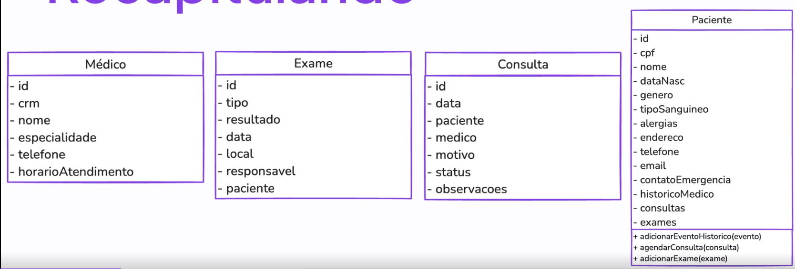

# Tactical Design Elements: Building Blocks of the Domain Model

## Introduction

In Domain-Driven Design, the **domain model** is built using specific tactical patterns and building blocks. These elements help us translate real-world business concepts into well-structured, maintainable code that accurately represents the domain.

This document explores the five core building blocks that form the foundation of your domain model:

1. **Entities** - Objects with unique identity
2. **Value Objects** - Objects defined by their attributes
3. **Aggregates** - Clusters of related objects with consistency boundaries
4. **Domain Services** - Operations that don't naturally belong to entities
5. **Repositories** - Abstractions for accessing and persisting aggregates

Let's explore each element using examples from the **Rocket Medic** healthcare domain.

## Rocket Medic Entity Model

The diagram below illustrates the entity relationships in our healthcare domain implementation:



This model shows how Patient, Doctor, Consultation, Examination, and MedicalRecord entities relate to each other in the system.

---

## 1. Entities

### What is an Entity?

An **Entity** is an object that has a **unique identity** that persists throughout its lifecycle, even when its attributes change. Two entities are considered the same if they have the same identity, regardless of whether their other attributes differ.

> **Key Characteristic:** Identity matters more than attributes.

### How to Identify Entities

Ask yourself: "Does this object need to be tracked individually over time, even if its properties change?"

If the answer is **yes**, it's likely an entity.

### Real-World Examples

#### In the Rocket Medic Domain:

**Patient:**

- A patient is uniquely identified (e.g., by medical record number)
- Even if the patient changes their address, phone number, or name, they're still the same patient
- Their medical history follows them throughout their lifetime

**Doctor:**

- A doctor has a unique professional identity (license number)
- If they update their specialty or contact information, they remain the same doctor
- Their credentials and history persist over time

```javascript
// Doctor Entity from Rocket Medic
class Doctor {
  constructor(id, rcm, name, specialty, phoneNumber) {
    // Identity
    this.id = id; // Unique identifier
    this.rcm = rcm; // Medical license number (domain identifier)

    // Attributes
    this.name = name;
    this.specialty = specialty; // Array of specialties
    this.phoneNumber = phoneNumber;
    this.workingHours = new WorkingHours(); // Value object for schedule
  }

  addWorkingHours(day, timeSlot) {
    this.workingHours.addHours(day, timeSlot);
  }

  removeWorkingHours(day, timeSlot) {
    this.workingHours.removeHours(day, timeSlot);
  }
}
```

**Appointment:**

- Each appointment is a unique scheduled event
- Even if details like time or location are modified, it's still the same appointment
- Has a distinct lifecycle: scheduled → confirmed → completed → cancelled

### Entity Characteristics

1. **Unique Identity:** Each entity has an identifier that distinguishes it from all others
2. **Mutability:** Entities can change their attributes over time
3. **Lifecycle:** Entities have a lifespan with states and transitions
4. **Continuity:** The same entity is tracked across different operations and time periods

### Implementation Example: Patient Entity (from Rocket Medic)

```javascript
class Patient {
  constructor(
    id,
    identificationDocument,
    name,
    dateOfBirth,
    gender,
    bloodType,
    address,
    phoneNumber,
    email,
    emergencyContact
  ) {
    // Identity - this never changes
    this.id = id; // Unique identifier
    this.identificationDocument = identificationDocument; // Document ID

    // Mutable attributes - these can change
    this.name = name;
    this.dateOfBirth = dateOfBirth;
    this.gender = gender;
    this.bloodType = bloodType;
    this.address = address; // Value object
    this.phoneNumber = phoneNumber;
    this.email = email;
    this.emergencyContact = emergencyContact; // Value object

    // Collections tracking patient's medical interactions
    this.allergies = [];
    this.appointments = [];
    this.examinations = [];
    this.medicalRecord = new MedicalRecord();
  }

  // Business method: Schedule an appointment
  scheduleAppointment(appointment) {
    if (!(appointment instanceof Appointment)) {
      throw new Error('Invalid appointment');
    }

    // Business rule: Can't have conflicting appointments
    const hasConflict = this.appointments.some((existingAppointment) =>
      appointment.hasConflict(existingAppointment)
    );

    if (hasConflict) {
      throw new Error(`Appointment conflict detected for patient ${this.name}`);
    }

    this.appointments.push(appointment);
    console.log(
      `Appointment on ${appointment.date} scheduled for patient ${this.name}`
    );
  }

  // Business method: Add allergy
  addAllergy(allergy) {
    if (!(allergy instanceof Allergy)) {
      throw new Error('Invalid allergy');
    }

    // Business rule: Prevent duplicate allergies
    const hasAllergy = this.allergies.some((a) => a.equals(allergy));

    if (!hasAllergy) {
      this.allergies.push(allergy);
      console.log(`Allergy ${allergy.type} added to patient ${this.name}`);
    } else {
      console.log(`Allergy already exists for patient ${this.name}`);
    }
  }

  // Business method: Add examination results
  addExamination(exam) {
    if (!(exam instanceof Examinations)) {
      throw new Error('Invalid examination');
    }

    this.examinations.push({ exam });
    console.log(`Examination ${exam.name} added with result: ${exam.result}`);
  }

  // Business method: Add diagnosis
  addDiagnosis(description) {
    const diagnosis = new Diagnosis(description);
    this.medicalRecord.addDiagnosis(diagnosis);
    console.log(`Diagnosis ${description} added to patient ${this.name}`);
  }
}
```

### Why This Is an Entity

- **Unique Identity:** `id` and `identificationDocument` uniquely identify the patient
- **Mutable:** Contact info, allergies, and medical records can change over time
- **Lifecycle:** A patient goes through various states (registered, active, inactive)
- **Equality:** Two patients are the same if they have the same `id`, not if they have the same name
- **Business Logic:** Methods like `scheduleAppointment()` and `addAllergy()` enforce business rules

---

## 2. Value Objects

### What is a Value Object?

A **Value Object** is an object that is defined entirely by its attributes and has no unique identity. Two value objects with the same attributes are considered identical and interchangeable.

> **Key Characteristic:** Attributes define equality, not identity.

### How to Identify Value Objects

Ask yourself: "Do I care about which specific instance this is, or only about its value?"

If you only care about the **value**, it's a value object.

### Real-World Examples

#### In the Rocket Medic Domain:

**Address:**

- Two addresses with the same street, city, and postal code are identical
- You don't need to track "which" address instance you're using
- If any part of the address changes, it becomes a different address (immutable)

**BloodPressure:**

- Defined by systolic and diastolic numbers
- 120/80 is 120/80, regardless of when or where it was measured in the system
- The measurement itself has no identity

**Money/Cost:**

- A $100 charge is just $100
- You don't track the identity of the "hundred dollars" concept
- Defined purely by amount and currency

### Value Object Characteristics

1. **No Identity:** No unique identifier needed
2. **Immutability:** Once created, values don't change (create a new instance instead)
3. **Equality by Value:** Two value objects are equal if all their attributes match
4. **Replaceability:** Can be freely replaced with another instance with the same values
5. **Self-Validation:** Responsible for ensuring their own validity

### Rocket Medic Value Objects

The diagram below illustrates how Address and EmergencyContact value objects are structured in our implementation:


### Implementation Example: Address Value Object (from Rocket Medic)

```javascript
class Address {
  constructor(street, number, city, state, zipCode) {
    this.street = street;
    this.number = number;
    this.city = city;
    this.state = state;
    this.zipCode = zipCode;
  }

  // Value-based equality - compares all attributes
  equals(otherAddress) {
    return (
      this.street === otherAddress.street &&
      this.number === otherAddress.number &&
      this.city === otherAddress.city &&
      this.state === otherAddress.state &&
      this.zipCode === otherAddress.zipCode
    );
  }
}
```

**Key Points:**

- **No Identity:** No `id` field - the address is defined by its attributes
- **Value Equality:** Two addresses are equal if all fields match
- **Immutability:** In practice, should be made immutable (can be enhanced with `Object.freeze()`)
- **Reusable:** Can be used by Patient, Doctor, Clinic, etc.

### Implementation Example: EmergencyContact Value Object (from Rocket Medic)

```javascript
class EmergencyContact {
  constructor(name, phone) {
    this.name = name;
    this.phone = phone;
  }

  // Value-based equality
  equals(otherContact) {
    return this.name === otherContact.name && this.phone === otherContact.phone;
  }
}
```

**Usage in Patient Entity:**

```javascript
// Creating value objects
const address = new Address(
  'Main Street',
  '123',
  'Mesopotamia',
  'Lost State',
  '11234'
);
const emergencyContact = new EmergencyContact('Jane Doe', '+0987654321');

// Using value objects in entity
const patient = new Patient(
  '1', // id (entity identity)
  '123.123.123-12', // identificationDocument
  'John Doe', // name
  '1990-01-01', // dateOfBirth
  'Male', // gender
  'O+', // bloodType
  address, // Address value object
  '+1234567890', // phoneNumber
  'johndoe@example.com', // email
  emergencyContact // EmergencyContact value object
);
```

### Implementation Example: WorkingHours Value Object (from Rocket Medic)

The diagram below shows how the WorkingHours value object is structured:


```javascript
class WorkingHours {
  constructor() {
    this.hours = [];
  }

  addHours(day, timeSlot) {
    this.hours.push({ day, timeSlot });
  }

  removeHours(day, timeSlot) {
    this.hours = this.hours.filter(
      (hour) => hour.day !== day && hour.timeSlot !== timeSlot
    );
  }

  // Value-based equality - compares all hours
  equals(otherWorkingHours) {
    if (this.hours.length !== otherWorkingHours.hours.length) {
      return false;
    }

    return this.hours.every((hour, index) => {
      const other = otherWorkingHours.hours[index];
      return hour.day === other.day && hour.timeSlot === other.timeSlot;
    });
  }

  listHours() {
    return this.hours;
  }
}
```

**Usage in Doctor Entity:**

```javascript
const WorkingHours = require('./workingHours');

class Doctor {
  constructor(id, rcm, name, specialty, phoneNumber, availableHours) {
    this.id = id;
    this.rcm = rcm;
    this.name = name;
    this.specialty = specialty;
    this.phoneNumber = phoneNumber;
    this.workingHours = new WorkingHours(); // Value object
  }

  addWorkingHours(day, timeSlot) {
    this.workingHours.addHours(day, timeSlot);
  }

  removeWorkingHours(day, timeSlot) {
    this.workingHours.removeHours(day, timeSlot);
  }

  listWorkingHours() {
    return this.workingHours.listHours();
  }
}

// Usage example
const doctor1 = new Doctor(
  '101',
  'CRM12345',
  'Dr. Smith',
  ['Cardiology', 'General Medicine'],
  '+1122334455'
);

doctor1.addWorkingHours('Monday', '09:00-17:00');
doctor1.addWorkingHours('Wednesday', '09:00-17:00');
```

### Why Use Value Objects?

1. **Clarity:** Makes the domain model more expressive (`patient.address.city` vs `patient.city`)
2. **Validation:** Centralized validation ensures values are always valid
3. **Immutability:** Prevents accidental changes and makes code easier to reason about
4. **Reusability:** Can be used across different entities
5. **Business Logic:** Can encapsulate domain rules (like blood pressure categories)

---

## 3. Aggregates

### What is an Aggregate?

An **Aggregate** is a cluster of related entities and value objects that are treated as a single unit for data consistency. Each aggregate has a boundary and a root entity (the **Aggregate Root**) that controls access to everything inside the aggregate.

> **Key Characteristic:** A consistency boundary around related objects.

### The Aggregate Root

The **Aggregate Root** is the only entity within the aggregate that external objects can reference directly. All interactions with the aggregate must go through the root.

**Rules:**

1. External objects can only hold references to the aggregate root
2. Internal objects can reference each other
3. Only the aggregate root can be obtained through queries/repositories
4. Changes to anything inside must go through the root

### Why Aggregates Matter

1. **Consistency:** Ensure business rules are enforced across related objects
2. **Encapsulation:** Hide complexity and protect invariants
3. **Transactional Boundaries:** Define what must be saved/updated together
4. **Simplified Design:** Reduce coupling between objects

### Real-World Examples

#### In the Rocket Medic Domain:

**Appointment Aggregate:**

- **Root:** Appointment entity
- **Internal parts:** Examination items, vital signs measurements, prescription items
- **Invariant:** An appointment must have a valid patient, doctor, and scheduled time
- **Rule:** You can't add a prescription item without the appointment being marked as "In Progress" or "Completed"

**Prescription Aggregate:**

- **Root:** Prescription entity
- **Internal parts:** Medication items (each with drug, dosage, frequency)
- **Invariant:** All medications must be reviewed for drug interactions
- **Rule:** Can't mark prescription as "Active" if patient has allergies to any medications

### Implementation Example: Appointment Aggregate

```javascript
// Value Objects used within the aggregate
class VitalSigns {
  constructor(bloodPressure, heartRate, temperature, weight) {
    this._bloodPressure = bloodPressure; // BloodPressure value object
    this._heartRate = heartRate;
    this._temperature = temperature;
    this._weight = weight;
    Object.freeze(this);
  }

  get bloodPressure() {
    return this._bloodPressure;
  }
  get heartRate() {
    return this._heartRate;
  }
  get temperature() {
    return this._temperature;
  }
  get weight() {
    return this._weight;
  }
}

class DiagnosisNote {
  constructor(code, description, severity) {
    if (!code || !description) {
      throw new Error('Diagnosis must have code and description');
    }
    this._code = code;
    this._description = description;
    this._severity = severity;
    Object.freeze(this);
  }

  get code() {
    return this._code;
  }
  get description() {
    return this._description;
  }
  get severity() {
    return this._severity;
  }
}

// Aggregate Root: Appointment
class Appointment {
  constructor(appointmentId, patientId, doctorId, scheduledDateTime) {
    // Identity
    this.appointmentId = appointmentId;

    // External references (only IDs, not full entities)
    this.patientId = patientId;
    this.doctorId = doctorId;

    // Aggregate state
    this.scheduledDateTime = scheduledDateTime;
    this.status = 'Scheduled'; // Scheduled, InProgress, Completed, Cancelled

    // Internal parts of the aggregate (protected from outside)
    this._vitalSigns = null;
    this._diagnoses = [];
    this._prescribedMedications = [];
    this._notes = '';
    this._completedDateTime = null;
  }

  // Business method: Start the appointment
  startAppointment() {
    // Business rule enforcement
    if (this.status !== 'Scheduled') {
      throw new Error('Can only start a scheduled appointment');
    }

    const now = new Date();
    if (now < this.scheduledDateTime) {
      throw new Error('Cannot start appointment before scheduled time');
    }

    this.status = 'InProgress';
  }

  // Business method: Record vital signs
  recordVitalSigns(vitalSigns) {
    // Invariant: Can only record vitals during an active appointment
    if (this.status !== 'InProgress') {
      throw new Error(
        'Can only record vital signs during an in-progress appointment'
      );
    }

    this._vitalSigns = vitalSigns;
  }

  // Business method: Add diagnosis
  addDiagnosis(diagnosis) {
    if (this.status !== 'InProgress') {
      throw new Error('Can only add diagnosis during appointment');
    }

    // Business rule: No duplicate diagnoses
    if (this._diagnoses.some((d) => d.code === diagnosis.code)) {
      throw new Error('This diagnosis has already been added');
    }

    this._diagnoses.push(diagnosis);
  }

  // Business method: Prescribe medication
  prescribeMedication(medication) {
    if (this.status !== 'InProgress' && this.status !== 'Completed') {
      throw new Error('Can only prescribe during or after appointment');
    }

    this._prescribedMedications.push(medication);
  }

  // Business method: Complete appointment
  completeAppointment(notes) {
    // Invariant: Must have been in progress
    if (this.status !== 'InProgress') {
      throw new Error('Can only complete an in-progress appointment');
    }

    // Business rule: Must have recorded vital signs
    if (!this._vitalSigns) {
      throw new Error('Must record vital signs before completing appointment');
    }

    // Business rule: Must have at least one diagnosis
    if (this._diagnoses.length === 0) {
      throw new Error('Must record at least one diagnosis');
    }

    this.status = 'Completed';
    this._completedDateTime = new Date();
    this._notes = notes;
  }

  // Getters for internal state (read-only access from outside)
  getVitalSigns() {
    return this._vitalSigns;
  }
  getDiagnoses() {
    return [...this._diagnoses];
  } // Return copy
  getPrescribedMedications() {
    return [...this._prescribedMedications];
  }
  getNotes() {
    return this._notes;
  }
}
```

### Aggregate Design Guidelines

1. **Keep Aggregates Small:** Only include what must be consistent together
2. **Reference by Identity:** Aggregates reference other aggregates by ID, not direct object reference
3. **One Transaction = One Aggregate:** Changes to one aggregate = one database transaction
4. **Enforce Invariants:** The root protects business rules across all internal objects
5. **Design Around Use Cases:** Think about how the aggregate will be used in real scenarios

### Example: Using the Appointment Aggregate

```javascript
// Creating a new appointment
const appointment = new Appointment(
  'APT-12345',
  'PAT-67890',
  'DOC-54321',
  new Date('2025-01-15T10:00:00')
);

// Starting the appointment
appointment.startAppointment();

// Recording patient vitals
const bp = new BloodPressure(120, 80);
const vitals = new VitalSigns(bp, 72, 98.6, 70);
appointment.recordVitalSigns(vitals);

// Adding a diagnosis
const diagnosis = new DiagnosisNote(
  'J00',
  'Acute nasopharyngitis (common cold)',
  'Mild'
);
appointment.addDiagnosis(diagnosis);

// Completing the appointment
appointment.completeAppointment(
  'Patient responded well to examination. Prescribed rest and fluids.'
);

// The aggregate ensures all business rules are enforced!
```

---

## 4. Domain Services

### What is a Domain Service?

A **Domain Service** is an operation or piece of business logic that doesn't naturally belong to any single entity or value object. It represents domain concepts that are actions or processes rather than things.

> **Key Characteristic:** Stateless operations that coordinate between multiple domain objects or perform calculations that don't belong to one entity.

### When to Use Domain Services

Use a domain service when:

1. The operation involves multiple aggregates or entities
2. The logic doesn't naturally fit into any single entity
3. The operation represents a significant domain concept or process
4. Placing the logic in an entity would force awkward dependencies

**Warning:** Don't overuse domain services! If logic naturally belongs to an entity or value object, put it there first.

### Real-World Examples

#### In the Rocket Medic Domain:

**AppointmentSchedulingService:**

- Checks doctor availability across their schedule
- Validates patient isn't double-booked
- Applies business rules for appointment timing (minimum advance notice, maximum appointments per day)
- Involves multiple entities (Doctor, Patient, existing Appointments)

**DrugInteractionCheckService:**

- Analyzes multiple medications for dangerous interactions
- Accesses external drug databases
- Doesn't belong to Prescription (which is about one prescription, not comparing drugs)
- Doesn't belong to Medication (which is just a value describing a drug)

**InsuranceCoverageCalculatorService:**

- Determines what portion of a medical service is covered by insurance
- Involves patient's insurance plan, procedure codes, and billing rules
- Complex calculation that doesn't belong to Patient or Appointment

### Domain Services vs Application Services

**Domain Services:**

- Part of the domain layer
- Contain business logic and rules
- Work with domain objects (entities, value objects)
- Express domain concepts
- Examples: "Calculate risk score", "Verify drug compatibility"

**Application Services:**

- Part of the application layer
- Orchestrate use cases and workflows
- Coordinate domain objects and services
- Handle transactions and infrastructure concerns
- Examples: "Schedule appointment and send confirmation email", "Process payment and generate receipt"

### Implementation Example: AppointmentSchedulingService

```javascript
class AppointmentSchedulingService {
  constructor(appointmentRepository, doctorRepository) {
    this.appointmentRepository = appointmentRepository;
    this.doctorRepository = doctorRepository;
  }

  // Domain logic: Can this appointment be scheduled?
  async canScheduleAppointment(
    doctorId,
    patientId,
    requestedDateTime,
    duration
  ) {
    // Business rule 1: Must be at least 24 hours in advance
    const hoursUntilAppointment =
      (requestedDateTime - new Date()) / (1000 * 60 * 60);
    if (hoursUntilAppointment < 24) {
      return {
        canSchedule: false,
        reason: 'Appointments must be scheduled at least 24 hours in advance',
      };
    }

    // Business rule 2: Must be during business hours
    const hour = requestedDateTime.getHours();
    if (hour < 8 || hour >= 18) {
      return {
        canSchedule: false,
        reason: 'Appointments must be between 8:00 AM and 6:00 PM',
      };
    }

    // Business rule 3: Check doctor availability
    const doctor = await this.doctorRepository.findById(doctorId);
    if (!doctor || !doctor.isAvailableOn(requestedDateTime)) {
      return {
        canSchedule: false,
        reason: 'Doctor is not available at this time',
      };
    }

    // Business rule 4: Check for conflicting appointments
    const conflictingAppointments =
      await this.appointmentRepository.findByDoctorAndTimeRange(
        doctorId,
        requestedDateTime,
        new Date(requestedDateTime.getTime() + duration * 60000)
      );

    if (conflictingAppointments.length > 0) {
      return {
        canSchedule: false,
        reason: 'Doctor has a conflicting appointment at this time',
      };
    }

    // Business rule 5: Patient can't have multiple appointments on same day
    const patientAppointmentsSameDay =
      await this.appointmentRepository.findByPatientAndDate(
        patientId,
        requestedDateTime
      );

    if (patientAppointmentsSameDay.length > 0) {
      return {
        canSchedule: false,
        reason: 'Patient already has an appointment scheduled this day',
      };
    }

    return { canSchedule: true };
  }

  // Domain logic: Calculate optimal appointment time
  async suggestAppointmentTimes(doctorId, patientPreferredDays, duration) {
    const doctor = await this.doctorRepository.findById(doctorId);
    const existingAppointments =
      await this.appointmentRepository.findByDoctorInDateRange(
        doctorId,
        new Date() /* 30 days from now */
      );

    // Business logic to find available slots
    // This is complex domain logic that doesn't belong to Doctor or Appointment
    const availableSlots = [];

    // Algorithm to find gaps in schedule...
    // Considers doctor's working hours, existing appointments, lunch breaks, etc.

    return availableSlots;
  }
}
```

### Implementation Example: DrugInteractionCheckService

```javascript
class DrugInteractionCheckService {
  constructor(drugDatabase) {
    this.drugDatabase = drugDatabase;
  }

  // Domain logic: Check for dangerous drug interactions
  async checkInteractions(medications, patientAllergies) {
    const interactions = [];

    // Check each medication against patient allergies
    for (const medication of medications) {
      for (const allergy of patientAllergies) {
        if (
          this.isDrugRelatedToAllergen(medication.drugName, allergy.allergen)
        ) {
          interactions.push({
            severity: 'CRITICAL',
            type: 'ALLERGY',
            message: `Patient is allergic to ${allergy.allergen}, which is related to ${medication.drugName}`,
            medications: [medication.drugName],
          });
        }
      }
    }

    // Check for drug-to-drug interactions
    for (let i = 0; i < medications.length; i++) {
      for (let j = i + 1; j < medications.length; j++) {
        const drug1 = medications[i].drugName;
        const drug2 = medications[j].drugName;

        const interaction = await this.drugDatabase.checkInteraction(
          drug1,
          drug2
        );

        if (interaction) {
          interactions.push({
            severity: interaction.severity,
            type: 'DRUG_INTERACTION',
            message: interaction.description,
            medications: [drug1, drug2],
          });
        }
      }
    }

    return interactions;
  }

  // Domain logic: Check if drug is safe for patient conditions
  async checkContraindications(medication, patientConditions) {
    const contraindications = [];

    for (const condition of patientConditions) {
      const isContraindicated = await this.drugDatabase.checkContraindication(
        medication.drugName,
        condition.code
      );

      if (isContraindicated) {
        contraindications.push({
          condition: condition.description,
          reason: isContraindicated.reason,
          severity: isContraindicated.severity,
        });
      }
    }

    return contraindications;
  }

  isDrugRelatedToAllergen(drugName, allergen) {
    // Complex domain logic...
    // Checks drug compounds against known allergens
    return false; // Simplified
  }
}
```

### Domain Service Characteristics

1. **Stateless:** No internal state; operates on inputs provided
2. **Domain-Focused:** Expresses domain concepts and business rules
3. **Coordination:** Often coordinates between multiple entities or aggregates
4. **Named After Domain Concepts:** Uses ubiquitous language from the domain

---

## 5. Repositories

### What is a Repository?

A **Repository** is an abstraction that provides the illusion of an in-memory collection of aggregates. It encapsulates all the logic needed to access, store, and retrieve aggregates from the persistence layer, allowing the domain layer to remain ignorant of database details.

> **Key Characteristic:** Mediates between the domain and data persistence, acting like a collection interface.

### Why Repositories Matter

1. **Domain Isolation:** Domain layer doesn't know about databases
2. **Abstraction:** Hides persistence complexity behind a simple interface
3. **Testability:** Easy to mock or use in-memory implementations for testing
4. **Consistency:** Single place to handle persistence logic for each aggregate
5. **Flexibility:** Can change database technology without affecting domain logic

### Repository Pattern Rules

1. **One Repository per Aggregate Root:** Only aggregate roots have repositories
2. **Collection-Like Interface:** Methods like `findById()`, `save()`, `remove()`
3. **Returns Domain Objects:** Repositories return fully-formed entities, not data transfer objects
4. **Encapsulates Queries:** Complex query logic is hidden inside the repository
5. **Interface in Domain, Implementation in Infrastructure:** The interface belongs to domain layer; concrete implementation belongs to infrastructure layer

### Real-World Examples

#### In the Rocket Medic Domain:

**PatientRepository:**

- Find patient by ID or medical record number
- Save new or updated patient
- Search patients by name or other criteria
- Remove patient records (with business rules)

**AppointmentRepository:**

- Find appointments by ID
- Find all appointments for a patient or doctor
- Find appointments in a date range
- Save and update appointments

**PrescriptionRepository:**

- Find prescriptions by patient
- Find active prescriptions
- Save new prescriptions
- Mark prescriptions as filled or cancelled

### Repository vs DAO (Data Access Object)

**Repository:**

- Domain-centric (uses domain language)
- Works with aggregates
- Returns domain entities
- Interface defined in domain layer
- Example: `patientRepository.findByMedicalRecordNumber(mrn)`

**DAO:**

- Database-centric (uses database language)
- Works with tables/documents
- Returns data structures or DTOs
- Purely in infrastructure layer
- Example: `patientDao.selectWhere("medical_record_number = ?")`

### Implementation Example: Repository Interface (Domain Layer)

```javascript
// This interface lives in the DOMAIN layer
// It defines what the domain needs, not how it's implemented

class IPatientRepository {
  /**
   * Find a patient by their unique identifier
   * @param {string} patientId
   * @returns {Promise<Patient|null>}
   */
  async findById(patientId) {
    throw new Error('Must be implemented by concrete repository');
  }

  /**
   * Find a patient by medical record number
   * @param {string} medicalRecordNumber
   * @returns {Promise<Patient|null>}
   */
  async findByMedicalRecordNumber(medicalRecordNumber) {
    throw new Error('Must be implemented by concrete repository');
  }

  /**
   * Search patients by name (partial match)
   * @param {string} nameQuery
   * @returns {Promise<Patient[]>}
   */
  async searchByName(nameQuery) {
    throw new Error('Must be implemented by concrete repository');
  }

  /**
   * Find all patients with a specific active condition
   * @param {string} conditionCode
   * @returns {Promise<Patient[]>}
   */
  async findByActiveCondition(conditionCode) {
    throw new Error('Must be implemented by concrete repository');
  }

  /**
   * Save a patient (create or update)
   * @param {Patient} patient
   * @returns {Promise<void>}
   */
  async save(patient) {
    throw new Error('Must be implemented by concrete repository');
  }

  /**
   * Remove a patient (following business rules)
   * @param {string} patientId
   * @returns {Promise<void>}
   */
  async remove(patientId) {
    throw new Error('Must be implemented by concrete repository');
  }
}
```

### Implementation Example: Repository Interface for Appointments

```javascript
// Domain layer interface

class IAppointmentRepository {
  /**
   * Find appointment by ID
   */
  async findById(appointmentId) {
    throw new Error('Must be implemented');
  }

  /**
   * Find all appointments for a specific patient
   */
  async findByPatientId(patientId) {
    throw new Error('Must be implemented');
  }

  /**
   * Find all appointments for a specific doctor
   */
  async findByDoctorId(doctorId) {
    throw new Error('Must be implemented');
  }

  /**
   * Find appointments in a date range
   */
  async findInDateRange(startDate, endDate) {
    throw new Error('Must be implemented');
  }

  /**
   * Find doctor's appointments on a specific date
   */
  async findByDoctorAndDate(doctorId, date) {
    throw new Error('Must be implemented');
  }

  /**
   * Find appointments that conflict with a time range
   * (for a specific doctor)
   */
  async findByDoctorAndTimeRange(doctorId, startTime, endTime) {
    throw new Error('Must be implemented');
  }

  /**
   * Save appointment (create or update)
   */
  async save(appointment) {
    throw new Error('Must be implemented');
  }

  /**
   * Remove appointment
   */
  async remove(appointmentId) {
    throw new Error('Must be implemented');
  }
}
```

### Implementation Example: Concrete Repository (Infrastructure Layer)

```javascript
// This implementation lives in the INFRASTRUCTURE layer
// It knows about databases, ORMs, etc.

class PostgresPatientRepository extends IPatientRepository {
  constructor(databaseConnection) {
    super();
    this.db = databaseConnection;
  }

  async findById(patientId) {
    // SQL query to get patient data
    const result = await this.db.query(
      'SELECT * FROM patients WHERE patient_id = $1',
      [patientId]
    );

    if (result.rows.length === 0) {
      return null;
    }

    // Convert database row to domain entity
    return this._mapToDomainEntity(result.rows[0]);
  }

  async findByMedicalRecordNumber(medicalRecordNumber) {
    const result = await this.db.query(
      'SELECT * FROM patients WHERE medical_record_number = $1',
      [medicalRecordNumber]
    );

    if (result.rows.length === 0) {
      return null;
    }

    return this._mapToDomainEntity(result.rows[0]);
  }

  async searchByName(nameQuery) {
    const result = await this.db.query(
      'SELECT * FROM patients WHERE name ILIKE $1 ORDER BY name',
      [`%${nameQuery}%`]
    );

    return result.rows.map((row) => this._mapToDomainEntity(row));
  }

  async save(patient) {
    // Check if patient exists
    const exists = await this.findById(patient.patientId);

    if (exists) {
      // Update existing patient
      await this.db.query(
        `UPDATE patients
         SET name = $1, date_of_birth = $2, contact_info = $3,
             allergies = $4, active_conditions = $5, emergency_contact = $6
         WHERE patient_id = $7`,
        [
          patient.name,
          patient.dateOfBirth,
          JSON.stringify(patient.contactInfo),
          JSON.stringify(patient.allergies),
          JSON.stringify(patient.activeConditions),
          JSON.stringify(patient.emergencyContact),
          patient.patientId,
        ]
      );
    } else {
      // Insert new patient
      await this.db.query(
        `INSERT INTO patients
         (patient_id, medical_record_number, name, date_of_birth, contact_info,
          allergies, active_conditions, emergency_contact)
         VALUES ($1, $2, $3, $4, $5, $6, $7, $8)`,
        [
          patient.patientId,
          patient.medicalRecordNumber,
          patient.name,
          patient.dateOfBirth,
          JSON.stringify(patient.contactInfo),
          JSON.stringify(patient.allergies),
          JSON.stringify(patient.activeConditions),
          JSON.stringify(patient.emergencyContact),
        ]
      );
    }
  }

  async remove(patientId) {
    // Business rule: Can't delete patient with active appointments
    const activeAppointments = await this.db.query(
      `SELECT COUNT(*) FROM appointments
       WHERE patient_id = $1 AND status IN ('Scheduled', 'InProgress')`,
      [patientId]
    );

    if (parseInt(activeAppointments.rows[0].count) > 0) {
      throw new Error('Cannot delete patient with active appointments');
    }

    await this.db.query('DELETE FROM patients WHERE patient_id = $1', [
      patientId,
    ]);
  }

  // Private helper to convert database row to domain entity
  _mapToDomainEntity(row) {
    const patient = new Patient(
      row.patient_id,
      row.name,
      row.date_of_birth,
      row.medical_record_number
    );

    patient.contactInfo = JSON.parse(row.contact_info || 'null');
    patient.allergies = JSON.parse(row.allergies || '[]');
    patient.activeConditions = JSON.parse(row.active_conditions || '[]');
    patient.emergencyContact = JSON.parse(row.emergency_contact || 'null');

    return patient;
  }
}
```

### In-Memory Repository (For Testing)

```javascript
// Useful for unit tests - no database needed!

class InMemoryPatientRepository extends IPatientRepository {
  constructor() {
    super();
    this.patients = new Map(); // Store patients in memory
  }

  async findById(patientId) {
    return this.patients.get(patientId) || null;
  }

  async findByMedicalRecordNumber(medicalRecordNumber) {
    for (const patient of this.patients.values()) {
      if (patient.medicalRecordNumber === medicalRecordNumber) {
        return patient;
      }
    }
    return null;
  }

  async searchByName(nameQuery) {
    const query = nameQuery.toLowerCase();
    const results = [];

    for (const patient of this.patients.values()) {
      if (patient.name.toLowerCase().includes(query)) {
        results.push(patient);
      }
    }

    return results.sort((a, b) => a.name.localeCompare(b.name));
  }

  async save(patient) {
    this.patients.set(patient.patientId, patient);
  }

  async remove(patientId) {
    this.patients.delete(patientId);
  }

  // Test helper
  clear() {
    this.patients.clear();
  }
}
```

### Using Repositories in Domain Services

```javascript
class AppointmentBookingService {
  constructor(appointmentRepository, patientRepository, doctorRepository) {
    // Inject repository interfaces (dependency inversion)
    this.appointmentRepository = appointmentRepository;
    this.patientRepository = patientRepository;
    this.doctorRepository = doctorRepository;
  }

  async bookAppointment(patientId, doctorId, dateTime, duration) {
    // Use repositories to load aggregates
    const patient = await this.patientRepository.findById(patientId);
    if (!patient) {
      throw new Error('Patient not found');
    }

    const doctor = await this.doctorRepository.findById(doctorId);
    if (!doctor) {
      throw new Error('Doctor not found');
    }

    // Domain logic...
    const appointment = new Appointment(
      this.generateAppointmentId(),
      patientId,
      doctorId,
      dateTime
    );

    // Validate business rules...

    // Save through repository
    await this.appointmentRepository.save(appointment);

    return appointment;
  }
}
```

---

## Putting It All Together: A Complete Example

Let's see how all these building blocks work together in a real scenario from Rocket Medic.

### Current Implementation: testHospital.js

Here's how the Rocket Medic entities currently work together:

```javascript
// Import domain entities and value objects
const Pacient = require('./pacient');
const Doctor = require('./doctor');
const Consultation = require('./consultation');
const Examinations = require('./examinations');
const MedicalRecord = require('./medicalRecord');
const Address = require('./address');
const EmergencyContact = require('./emergencyContact');

// 1. Create Value Objects first
const address1 = new Address(
  'Main Street', // street
  '123', // number
  'Mezopotamia', // city
  'Lost State', // state
  '11234' // zipCode
);

const emergencyContact1 = new EmergencyContact(
  'Jane Doe', // name
  '+0987654321' // phone
);

// 2. Create a Patient entity using value objects
const pacient1 = new Pacient(
  '1', // id
  '123.123.123-12', // ssn
  'John Doe', // name
  '1990-01-01', // dateOfBirth
  'Male', // gender
  'O+', // bloodType
  'None', // allergies
  address1, // Address value object
  '+1234567890', // phoneNumber
  'johndoe@example.com', // email
  emergencyContact1 // EmergencyContact value object
);

// 3. Create a Doctor entity with WorkingHours value object
const doctor1 = new Doctor(
  '101', // id
  'CRM12345', // rcm (medical license)
  'Dr. Smith', // name
  ['Cardiology', 'General Medicine'], // specialty
  '+1122334455' // phoneNumber
  // WorkingHours value object created internally
);

// Add working hours using value object methods
doctor1.addWorkingHours('Monday', '09:00-17:00');
doctor1.addWorkingHours('Wednesday', '09:00-17:00');

// 4. Create a Consultation entity (links Patient and Doctor)
const consultation1 = new Consultation(
  '201', // id
  '2024-07-01', // date
  pacient1, // patient entity reference
  doctor1, // doctor entity reference
  'Chest pain', // reason
  'Scheduled', // status
  'Complains of chest pain after physical activity' // observations
);

// 5. Create an Examination entity
const examination1 = new Examinations(
  '301', // id
  'Blood Test', // type
  'Normal', // result
  '2024-06-15', // date
  'Lab Corp', // local
  'Dr. Adams', // responsibleDoctor
  pacient1 // patient entity reference
);

// 6. Create a MedicalRecord entity
const medicalRecord1 = new MedicalRecord(
  '401', // id
  pacient1 // patient entity reference
);

// 7. Execute business operations through entity methods
pacient1.scheduleAppointment(consultation1);
pacient1.addExamination(examination1);

medicalRecord1.addDiagnosis('Hypertension');
medicalRecord1.addTreatment('Low-sodium diet');
medicalRecord1.addMedication('Lisinopril');
```

### What This Example Demonstrates:

1. **Entities with Identity:** Patient, Doctor, Consultation, Examination, and MedicalRecord all have unique IDs
2. **Value Objects in Action:**
   - `Address` value object encapsulates location data
   - `EmergencyContact` value object groups contact information
   - `WorkingHours` value object manages doctor's schedule
3. **Separation of Concerns:** Value objects separate immutable concepts from entities
4. **Entity Relationships:** Entities reference each other (Patient ↔ Consultation ↔ Doctor)
5. **Business Methods:** Operations like `scheduleAppointment()`, `addWorkingHours()`, `addDiagnosis()` encapsulate business logic
6. **Business Rules:** The Patient entity prevents double-booking of consultations
7. **State Management:** Each entity maintains its own state and collections

### Future Enhancement: Complete Appointment Use Case

As the system evolves with richer domain models, here's how a complete appointment scenario would look:

```javascript
// === USE CASE: Complete Appointment ===

class CompleteAppointmentUseCase {
  constructor(
    appointmentRepository,
    patientRepository,
    drugInteractionService,
    prescriptionRepository
  ) {
    this.appointmentRepository = appointmentRepository;
    this.patientRepository = patientRepository;
    this.drugInteractionService = drugInteractionService;
    this.prescriptionRepository = prescriptionRepository;
  }

  async execute(
    appointmentId,
    vitalSignsData,
    diagnosisData,
    medicationsData,
    notes
  ) {
    // 1. Load the Appointment aggregate (via Repository)
    const appointment =
      await this.appointmentRepository.findById(appointmentId);
    if (!appointment) {
      throw new Error('Appointment not found');
    }

    // 2. Load the Patient entity (via Repository)
    const patient = await this.patientRepository.findById(
      appointment.patientId
    );
    if (!patient) {
      throw new Error('Patient not found');
    }

    // 3. Create Value Objects for vital signs
    const bloodPressure = new BloodPressure(
      vitalSignsData.systolic,
      vitalSignsData.diastolic
    );
    const vitalSigns = new VitalSigns(
      bloodPressure,
      vitalSignsData.heartRate,
      vitalSignsData.temperature,
      vitalSignsData.weight
    );

    // 4. Record vital signs on the Appointment (Entity business method)
    appointment.recordVitalSigns(vitalSigns);

    // 5. Add diagnoses to the Appointment (Entity business method)
    for (const diagData of diagnosisData) {
      const diagnosis = new DiagnosisNote(
        diagData.code,
        diagData.description,
        diagData.severity
      );
      appointment.addDiagnosis(diagnosis);

      // Also update patient's active conditions
      patient.diagnoseCondition({
        code: diagData.code,
        description: diagData.description,
        diagnosedDate: new Date(),
      });
    }

    // 6. Use Domain Service to check drug interactions
    const interactionCheck =
      await this.drugInteractionService.checkInteractions(
        medicationsData,
        patient.allergies
      );

    // If there are critical interactions, halt
    const criticalInteractions = interactionCheck.filter(
      (i) => i.severity === 'CRITICAL'
    );
    if (criticalInteractions.length > 0) {
      throw new Error(
        `Cannot prescribe medications due to critical interactions: ${criticalInteractions
          .map((i) => i.message)
          .join('; ')}`
      );
    }

    // 7. Prescribe medications through Appointment (Entity business method)
    for (const med of medicationsData) {
      appointment.prescribeMedication(med);
    }

    // 8. Complete the appointment (Entity business method enforces invariants)
    appointment.completeAppointment(notes);

    // 9. Persist changes via Repositories
    await this.appointmentRepository.save(appointment); // Save Aggregate
    await this.patientRepository.save(patient); // Save Entity

    return {
      appointment,
      warnings: interactionCheck.filter((i) => i.severity !== 'CRITICAL'),
    };
  }
}
```

### What We Used:

1. **Entities:** `Appointment`, `Patient` with unique identities and lifecycle
2. **Value Objects:** `BloodPressure`, `VitalSigns`, `DiagnosisNote` (immutable, defined by attributes)
3. **Aggregate:** `Appointment` aggregate with internal parts, enforcing consistency
4. **Domain Service:** `DrugInteractionCheckService` for cross-entity logic
5. **Repositories:** `AppointmentRepository`, `PatientRepository` for persistence abstraction

---

## Summary: Choosing the Right Building Block

| **Question**                                                         | **Answer** | **Building Block** |
| -------------------------------------------------------------------- | ---------- | ------------------ |
| Does it have a unique identity that persists over time?              | Yes        | **Entity**         |
| Is it defined purely by its attributes with no identity?             | Yes        | **Value Object**   |
| Does it need to enforce consistency across multiple related objects? | Yes        | **Aggregate**      |
| Is it business logic that doesn't fit in any single entity?          | Yes        | **Domain Service** |
| Do I need to persist and retrieve aggregates from storage?           | Yes        | **Repository**     |

---

## Best Practices

### For Entities:

- Always have a unique identifier
- Implement identity-based equality
- Keep mutable state private when possible
- Use methods to enforce business rules when changing state

### For Value Objects:

- Make them immutable
- Validate in the constructor
- Implement value-based equality
- Use them to make your model more expressive

### For Aggregates:

- Keep them small—only what needs to be consistent together
- Only reference other aggregates by ID
- Design around transactional boundaries
- Make the root the guardian of invariants

### For Domain Services:

- Use sparingly—prefer putting logic in entities first
- Keep them stateless
- Name them using domain language
- Use them for cross-aggregate operations

### For Repositories:

- One repository per aggregate root only
- Define interfaces in the domain layer
- Implement in the infrastructure layer
- Use collection-like method names
- Return fully-formed domain objects

---

## Conclusion

These five tactical building blocks—**Entities**, **Value Objects**, **Aggregates**, **Domain Services**, and **Repositories**—form the foundation of a well-designed domain model in Domain-Driven Design.

By understanding when and how to use each pattern, you can create software that:

- Accurately models your business domain
- Enforces business rules consistently
- Remains flexible as requirements change
- Is easier to understand, test, and maintain

In the Rocket Medic domain, we've seen how these patterns help us model complex healthcare scenarios while keeping our code clean, focused, and aligned with business needs.
